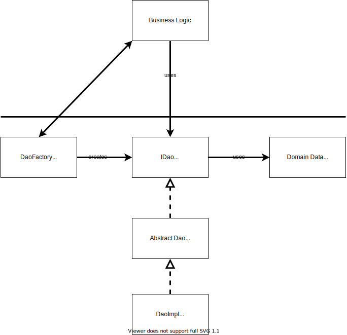

# Apollo
An all-in-one software solution for cinemas.

## Architecture
### Domain Model

The application contains six main entities. Each entity is being reflected in the database and in the domain classes.
The main entity is Movie. This entity contains all necessary data that needs to be stored related to a movie:
* **title**: unique specifier of the movie title
* **description**: short description of the movie in a few sentences
* **genre**: one or more genres in plain text
* **length**: movie length in minutes
* **actors**: main actors of the movie in plain text
* **imageURL**: link to the cover photo of the movie
* **trailerURL**: link to the trailer video of the movie

The entity that is directly connected to Movie is Show. A show represents a specific movie being showed in the cinema:
* **startsAt**: date and time when the show starts
In order to identify a show uniquely, it needs to be connected with a specific movie and a specific hall in the cinema. In theory, one movie could be shown at the same time in two different cinema halls.

A CinemaHall specifies a specific hall in the cinema where the movies are shown:
* **name**: a name that identifies the hall uniquely within a cinema
* **rowAmount**: number of rows in the hall
* **seatAmount**: number of seats per row

A Reservation hold all information needed to manage the reservations that can be ordered via the clients:
* **id**: an unique identifier
* **maxSeats**: the maxium amount of seats that can be reserved in this reservation
Each reservation has a connection to one or more seats and refers to a specific show

A seat comprises data of a specific seat for each show. For every movie that is shown, there is an extra seat entity:
* **seatNumber**: the number of the seat within a row
* **rowNumber**: the number of the row within a cinema hall

The last entity SeatCategory categoriezes each seat into a specific price category:
* **name**: the unique name of the seat category
* **price**: the price of a movie at this specific seat

### Structure of the Data Access Layer

The data access layer implements the DAO pattern which stands for Data Access Object. For each entity there is one central interface which is the access point for the business logic.
These interfaces use the domain classes that are implemented based on the domain model.
The interfaces are implemented by abstract classes in ADO.NET, which is an access technology to a memory system.
The abstract classes are finally overwritten by database specific classes. Apollo uses the Microsoft SQL Server Database Management System. The database for testing is an in-memory LocalDB which is also part of Microsoft SQL Server.
The database connection is created by factory classes using the factory pattern. Before the Business Logic can use the DAO interfaces, it needs to generate a data connection first using the factory classes.
